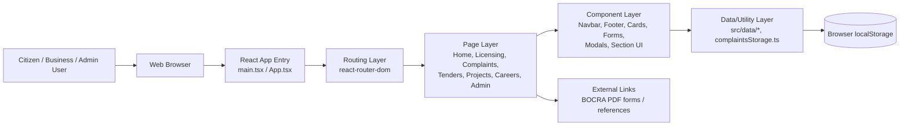

# Proposal: BOCRA Digital Service Platform

## 1. Executive Summary
This proposal presents the BOCRA Digital Service Platform, a modern web solution developed to improve how citizens, businesses, and regulators access communication-sector services in Botswana. The platform consolidates key services into a single, user-friendly portal, including complaints submission and tracking, licensing guidance and application support, public information pages, tenders, careers, and an administrative dashboard.

The solution is implemented as a responsive React + TypeScript web application. It demonstrates a strong foundation for digital public service delivery and can be extended into a full production system with backend integration, authentication, and workflow automation.

## 2. Background and Problem Statement
BOCRA stakeholders require quick, transparent, and accessible digital channels for:
- Filing and tracking complaints.
- Understanding licensing categories and requirements.
- Accessing regulatory information, tenders, projects, and careers.
- Enabling administrators to monitor and manage service workflows.

Traditional or fragmented service channels can create delays, limited visibility, and poor user experience. This project addresses those gaps through a centralized digital platform.

## 3. Project Objectives
The project objectives were to:
- Build a single platform for BOCRA public services and information.
- Improve user navigation through a clean, mobile-friendly interface.
- Enable end-to-end complaint submission and status tracking.
- Support licensing workflows with category guidance, downloadable forms, and tracking references.
- Provide an admin-facing dashboard prototype for operations and reporting.

## 4. System Design & Architecture
This repository contains the frontend system for the BOCRA Digital Service Platform. The architecture follows a modular Single Page Application (SPA) approach using React and TypeScript.

### 4.1 Frontend Architecture Diagram

### 4.2 Architecture Explanation (Frontend)
- Presentation Layer:
  - Built with reusable React components and page modules.
  - Handles responsive UI behavior for desktop and mobile.
- Routing Layer:
  - Centralized in `App.tsx` using `react-router-dom`.
  - Maps public and admin URLs to the correct page components.
- Feature Modules:
  - Public pages: home, about, projects, tenders, careers, legislation.
  - Service pages: complaints and licensing workflows.
  - Admin pages: dashboard, complaints, analytics, content, licensing, users, notifications.
- Data and Utilities:
  - Static and semi-static content is stored in `src/data/*`.
  - Complaint prototype persistence is handled by `utils/complaintsStorage.ts`.
  - Tracking IDs are generated on the client side for demo flow continuity.
- External Resource Integration:
  - Licensing forms and reference documents are linked to official BOCRA URLs.

### 4.3 Frontend Design Characteristics
- Component-based design:
  - Improves maintainability and reuse of UI blocks across pages.
- Route-based navigation:
  - Ensures clear separation of concerns between modules.
- User-centric workflow design:
  - Complaint and licensing pages are built as guided, step-by-step interactions.
- Progressive enhancement path:
  - Current frontend can be connected to backend APIs without restructuring the UI architecture.

## 5. Scope Delivered
### In Scope (Completed)
- Frontend application with routing and modular component architecture.
- Responsive UI for desktop and mobile.
- Interactive multi-step complaint and licensing experiences.
- Local demo persistence for complaints (via browser local storage).
- Admin module prototypes for management workflows and analytics presentation.

### Out of Scope (Current Phase)
- Secure authentication and role-based authorization.
- Live backend/database integration.
- Real-time notifications (email/SMS).
- Production reporting engine and audit trails.
- Full legal document repository and advanced search.

## 6. Technical Approach
### Technology Stack
- React 19
- TypeScript
- Vite
- React Router
- CSS Modules and utility-first styling patterns

### Architecture Highlights
- Component-based UI for reusability and maintainability.
- Route-driven structure for clear separation of pages/modules.
- Utility layer for complaint storage and tracking ID generation.
- Modular data files for content-driven sections (about, careers, projects, etc.).

## 7. Key Benefits and Expected Impact
The solution provides:
- Improved access to BOCRA services in one place.
- Better transparency through reference-based complaint and application tracking.
- Faster user self-service for licensing information.
- Stronger internal visibility through the admin dashboard concept.
- A scalable digital foundation for full e-government style service delivery.

## 8. Risks and Mitigation
### Key Risks
- Prototype features may be mistaken for production-ready workflows.
- No server-side validation in current implementation.
- Data durability is limited with local browser storage.

### Mitigation Plan
- Introduce backend APIs and centralized database.
- Implement authentication, authorization, and audit logging.
- Add production-grade validation, monitoring, and backup.
- Conduct security, accessibility, and performance testing before go-live.

## 9. Implementation Roadmap (Recommended Phase 2)
### Phase 2 Priorities
- Backend integration for complaints, licensing, and admin modules.
- Identity and access management for staff/admin workflows.
- Real notification channels (email/SMS/in-app).
- Workflow automation (assignment, escalation, approvals).
- Reporting exports and executive dashboards.
- Content management improvements for legislation and notices.

### Suggested Timeline
- Weeks 1-2: Backend/API design and database schema.
- Weeks 3-5: Integrate complaints and licensing APIs.
- Weeks 6-7: Authentication, roles, and admin hardening.
- Weeks 8-9: Notifications, reporting, and QA.
- Week 10: UAT, deployment, and training.

## 10. Success Metrics
Project success can be measured using:
- Reduction in average complaint response time.
- Increase in number of successfully tracked submissions.
- Percentage of licensing queries handled through self-service.
- User satisfaction scores (citizens and administrators).
- Admin processing efficiency (time-to-resolution and backlog reduction).

## 11. Conclusion
The BOCRA Digital Service Platform successfully delivers a practical, user-centered web solution that demonstrates how regulatory services can be modernized. It provides immediate value as a functional prototype and a clear path to production readiness through targeted Phase 2 enhancements.

This project positions BOCRA to improve service delivery, strengthen transparency, and support long-term digital transformation across its regulatory mandate.
